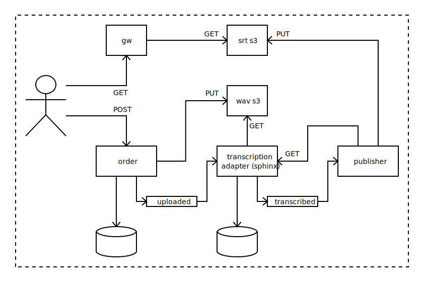

# CaptionCutter generate subtitles from wav files

Generates subtitle from Microsoft Wav files

Microservice architecture using AWS

## Set up development environment

Run local infra:

    docker-compose up -d

Get into `aws-cli` container - doing this it will create required SQS queue,
therefore it is required step to be performed before starting spring-boot services:

    docker-compose run aws-cli

You can run `ls` in hte container shell, to see what commands are available.

And then run the speech2text with:

    AWS_ACCESS_KEY=dummy AWS_SECRET_KEY=dummy mvn spring-boot:run

## Credits

Web resources used while building this app:

https://cmusphinx.github.io/wiki/tutorialsphinx4/

May be useful:

https://wiki.audacityteam.org/wiki/Movie_subtitles_(*.SRT)#tool
